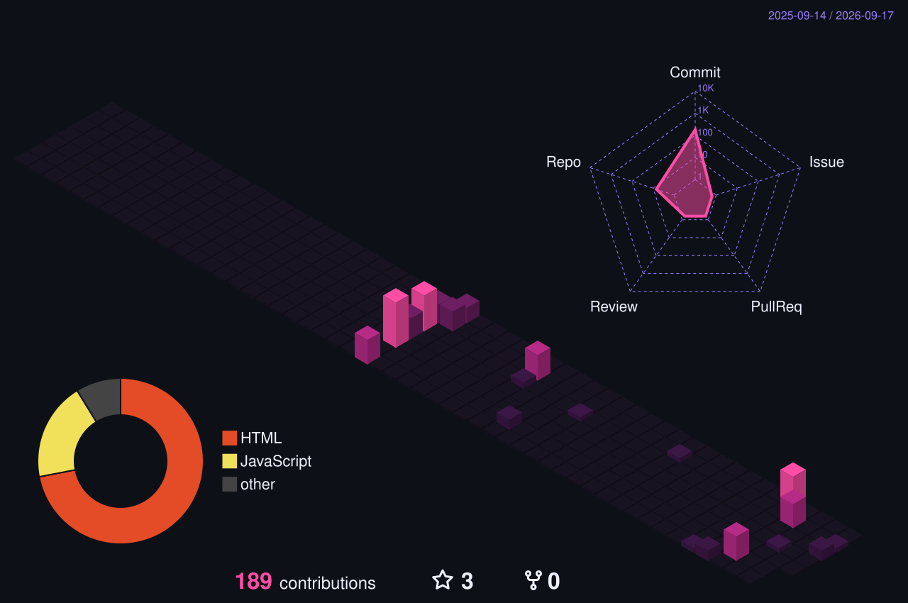

  

  

## 📌 About Me
- 🤖 Exploring Artificial Intelligence, Machine Learning, and Generative AI
- 💡 Turning real-world problems into innovative, user-focused products
- 🏆 Actively participating in hackathons and building under pressure
- ☁️ Learning and working with cloud technologies, including AWS
- 🌱 Continuously learning, experimenting, and improving as a developer
- 🤝 Open to collaborating on impactful tech and open-source projects

## 🧠 My Focus Areas
- Full-Stack Web Development
- Artificial Intelligence & Machine Learning
- Generative AI & AI-Powered Applications
- Cloud Computing & AWS
- Open Source Contribution
- Hackathons & Product Development

## 📊 GitHub Stats & Trophies

  
  

  

  

## 🛠️ Languages & Tools

<h3 align="center">Programming Languages</h3>

  &nbsp;&nbsp;&nbsp;&nbsp;&nbsp;&nbsp;&nbsp;&nbsp;&nbsp;&nbsp;
  &nbsp;&nbsp;&nbsp;&nbsp;&nbsp;&nbsp;&nbsp;&nbsp;&nbsp;&nbsp;
  

<h3 align="center">Frontend</h3>

  &nbsp;&nbsp;&nbsp;&nbsp;&nbsp;&nbsp;&nbsp;&nbsp;&nbsp;&nbsp;
  &nbsp;&nbsp;&nbsp;&nbsp;&nbsp;&nbsp;&nbsp;&nbsp;&nbsp;&nbsp;
  &nbsp;&nbsp;&nbsp;&nbsp;&nbsp;&nbsp;&nbsp;&nbsp;&nbsp;&nbsp;
  

<h3 align="center">Backend</h3>

  

<h3 align="center">Database</h3>

  &nbsp;&nbsp;&nbsp;&nbsp;&nbsp;&nbsp;&nbsp;&nbsp;&nbsp;&nbsp;
  

<h3 align="center">DevOps & Cloud</h3>

  

<h3 align="center">Tools</h3>

  &nbsp;&nbsp;&nbsp;&nbsp;&nbsp;&nbsp;&nbsp;&nbsp;&nbsp;&nbsp;
  &nbsp;&nbsp;&nbsp;&nbsp;&nbsp;&nbsp;&nbsp;&nbsp;&nbsp;&nbsp;
  &nbsp;&nbsp;&nbsp;&nbsp;&nbsp;&nbsp;&nbsp;&nbsp;&nbsp;&nbsp;
  

  

 

## 🔗 Connect with Me

  &nbsp;&nbsp;
  &nbsp;&nbsp;
  

  

